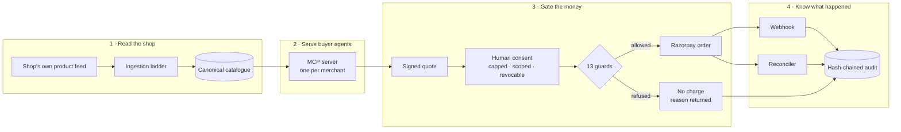
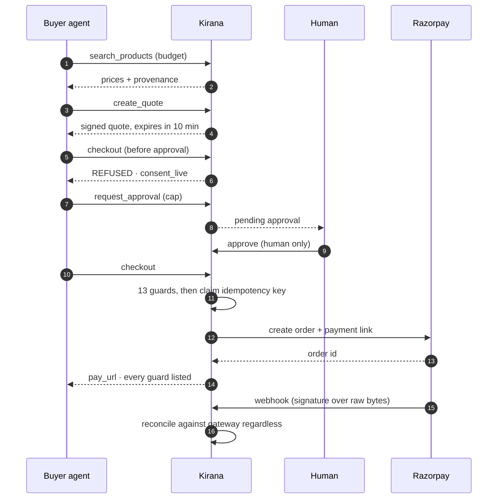

# Architecture

Kirana turns an ordinary storefront into something an AI agent can buy from, and
then makes sure the agent cannot misbehave with someone's money.

This document has a one-page summary, then the reasoning underneath.

---

## At a glance



| Layer | What it is |
|---|---|
| **Ingestion** | Reads a shop's real catalogue. Structured feeds first, a model only as a last resort — and buyers are told which was used. |
| **MCP server** | One per merchant, stateless. Nine tools: discover, search, quote, request approval, pay, check. |
| **Quote** | HMAC-signed, 10-minute expiry, re-derived from live prices at payment. |
| **Consent** | An agent may *request*; only a human may *grant*. Capped, scoped to one basket, revocable, expiring. |
| **MoneyGuard** | One choke point. Thirteen checks, and it returns all of them — pass or fail. |
| **Settlement** | Webhooks make it fast; the reconciler makes it correct. |
| **Audit** | Append-only, hash-chained, verifiable. |

**Stack.** Node 22 + TypeScript run directly (no build step — Node strips types),
Fastify, SQLite via `node:sqlite`, four dependencies, zero native modules.
~4,000 lines of server source, 101 tests.

---

## The money path

The only path that can move money, in order. Ordering is the whole design.



Three properties matter more than the individual steps.

**Authorise before any network call.** A refusal costs nothing and can never be
a half-charge. Of the thirteen guards, the ones most likely to fire — cap
exceeded, consent revoked, price drifted — all run before Razorpay is contacted.

**Claim the idempotency key in the database *before* calling the gateway.** The
dangerous window in payments is between "we decided to charge" and "we know
whether we charged". If two identical requests race, a `UNIQUE` constraint
decides the winner rather than timing.

**Record either way.** A refused charge is as auditable as a successful one, with
the gate that stopped it and the full check list.

---

## The thirteen guards

`authorise()` in `checkout/guard.ts` is the single function that can permit a
charge. It returns **every** check, pass or fail — a guard that returns a bare
boolean cannot explain itself, and the brief requires every money action to be
explainable.

| # | Guard | Enforces |
|---|---|---|
| 1 | `kill_switch` | A human can stop all spending instantly |
| 2 | `gateway_circuit` | We never start a payment into a gateway we know is failing |
| 3 | `idempotency` | The same request can never charge twice |
| 4 | `quote_integrity` | Signature valid, unexpired, unused, prices and stock unchanged |
| 5 | `quote_merchant` | A quote can only be paid to the shop that issued it |
| 6 | `consent_exists` | A human approved this spend |
| 7 | `consent_live` | Not revoked, not already used |
| 8 | `consent_unexpired` | Approval is time-limited |
| 9 | `consent_quote_match` | Approval is tied to one specific basket |
| 10 | `consent_agent_match` | Approval names the agent allowed to use it |
| 11 | `within_consent_cap` | The charge cannot exceed what the human approved |
| 12 | `within_per_order_cap` | A platform ceiling the human **cannot** raise |
| 13 | `within_daily_cap` | Rolling 24-hour ceiling |

Guards 11 and 12 are deliberately separate. Eleven is the human's number; twelve
is the platform's, and it outranks it. *Consent is necessary but not sufficient.*

---

## Design decisions

Each of these was a fork in the road, so the alternative is stated too.

### Money is an integer number of paise, everywhere

`parseFloat("499.10") * 100` is `49909.999999999993`. Prices are parsed from
decimal *strings*, never through a float, and there is a test asserting it.
Razorpay's API is paise-native too, so the representation is exact end to end.

### The ingestion ladder puts the model last

Structured feed → structured feed → structured page data → language model.
The alternative — point a model at the HTML and ask for JSON — is faster to build
and produces a catalogue that is roughly 95% right. In a payments context that is
another way of saying wrong. **And the buyer is told which tier was used**:
`get_merchant_info` returns `extracted_by_model: true|false`, so an agent
spending someone's money knows whether a price came from a feed or a guess.

### A quote is signed, not stored trust

The buyer is a program holding a JSON object, so the cheapest attack in the world
is to edit `total_minor` before paying. Totals are HMAC-signed over a canonical
serialisation and **re-derived from live catalogue prices** at payment. The agent
never gets to assert what something costs.

### An agent may request consent; only a human may grant it

Two separate functions in `checkout/consent.ts`. The request path is reachable by
the agent; the approval path is only reachable from the human console. There is
no argument an agent can pass that turns one into the other, and no code path
mutates a cap after the grant.

### One choke point, not scattered checks

There is exactly one function that authorises a charge. "Is this spend allowed"
therefore has one answer in one place, rather than drifting across handlers.

### Webhooks are a notification; the reconciler is the truth

Webhooks get lost — a dropped tunnel, a restarted process, a firewall, an expired
URL, arrival out of order. A system that treats *"no webhook"* as *"they didn't
pay"* will eventually tell a customer their money vanished. So the ledger is
reconciled against Razorpay directly every 20 seconds. Settlement is idempotent
precisely so both paths can race harmlessly.

The reconciler checks the **payment link before the order**, because a Razorpay
Order and a Payment Link are separate objects: a customer paying the link leaves
the order's payment list empty forever. That was a real bug, found by a real
payment, not by a test.

### The audit trail is hash-chained

Each row commits to the hash of the row before it, so anyone can re-walk the
chain and prove nothing was edited, reordered or removed. A table anyone could
`UPDATE` is a log, not an audit trail. Tests prove that editing a row and
deleting a row are both detected.

### The MCP endpoint is stateless

A fresh server and transport per request. No session state is worth keeping
between calls, and statelessness means a dropped tunnel or a restarted process
never strands a buyer agent mid-conversation.

### No build step, no native modules

Node 22 strips TypeScript types natively and ships SQLite in-box, so the server
runs from source with four pure-JS dependencies. The cost is real — strip-only
mode forbids parameter properties, enums and namespaces — but the benefit is that
a reviewer clones the repo and it runs, on any OS, with no toolchain. For a
project that has to be *tried* to be believed, that trade is worth it.

---

## Module map

```
server/src/
  types.ts              Canonical catalogue model. Money is always integer paise.
  app.ts                Routes, auth/rate-limit hook, MCP endpoint, webhook, console.
  index.ts              Boot: seed if empty, start reconciler, listen.

  lib/
    config.ts           Env, validated loudly. Refuses to start on a live key.
    db.ts               SQLite schema + additive migrations.
    money.ts            String-based decimal parsing. No floats touch a price.
    security.ts         SSRF guard, constant-time compare, rate limiter.
    http.ts             Fetch with timeout, UA, and redirect re-validation.
    staticfiles.ts      In-memory console bundle; no path resolution at runtime.

  adapters/shopify.ts   Tier 1 of the ladder. Availability absent = unavailable.
  catalog/
    ingest.ts           The ladder, SSRF-gated. Idempotent per merchant.
    store.ts            Persistence and search.

  checkout/
    quote.ts            Signed, expiring prices + the payment-time validator.
    consent.ts          request (agent) vs approve (human only).
    guard.ts            MoneyGuard. The thirteen checks.
    checkout.ts         The one function that can move money.
    agents.ts           Identity. Verified by key, or name-only and capped.
    reconcile.ts        Ask the gateway what actually happened.

  razorpay/client.ts    REST over fetch. Explicit retry + circuit breaker.
  mcp/                  server.ts (tool registration) · tools.ts (implementations)
  cli/                  seed · reset · probe · agent

web/src/
  App.tsx               Shell, persona switcher, sidebar, access handling.
  plain.ts              Engine events → shopkeeper English. The translation layer.
  personas/             Merchant.tsx · Shopper.tsx · Platform.tsx
```

---

## Data model

Nine tables. The ones that carry the argument:

- **`quotes`** — lines, totals, `signature`, `expires_at`, single-use `status`.
  "Single-use" is enforced by an atomic claim (`UPDATE … WHERE status='open'`)
  taken *before* the gateway call, not by a read in the guard and a write after
  it — with two awaited round-trips in between, that window let ten concurrent
  callers share one approval.
- **`consents`** — `cap_minor`, `scope`, `granted_by`, `expires_at`, `revoked_at`.
  Nothing mutates `cap_minor` after the grant.
- **`orders`** — `idempotency_key` is `UNIQUE`; that constraint is the concurrency
  control. Holds both `razorpay_order_id` and `razorpay_payment_link_id`.
  Statuses: `created` → `awaiting_payment` → `paid` / `failed` / `mismatch` /
  `expired`. `paid` is never downgraded; `mismatch` means money arrived that
  does not match the order and a human is needed.
- **`agents`** — `verified` separates a proven key from a self-asserted name.
  Unverified agents cannot have their caps raised.
- **`audit_log`** — append-only, `prev_hash` + `hash` per row.
- **`workspaces`** — one per visitor, created silently on first contact, carried
  in an HttpOnly `SameSite=Lax` cookie. Every table above carries the
  `workspace_id` that created the row.

---

## Tenancy

The console has three audiences and one database, so every read is scoped by the
workspace behind the request.

| Caller | Sees |
| --- | --- |
| Merchant | The shops they connected, and everything derived from them |
| Shopper | Their own approvals, orders and limits; the shop **directory** is public |
| Razorpay (platform) | Across every workspace |
| Reviewer mode | The persona's own view, widened on request — for judges |
| Operator token | Across every workspace by default |

Scoping a list is the easy half; the half that matters is every route addressed
by an **ID**, where there is no list to filter. `owns()` guards those, and
answers **404** rather than 403 so an unreachable identifier is not confirmed to
exist. It is not relaxed on the open sandbox, which is where strangers actually
share an instance.

Reading across tenants and **acting** across tenants are separate powers. A
visitor may hand themselves the platform role or reviewer mode and see
everything; only the operator token — the deploy secret — may approve, reject or
revoke another tenant's records. Audit rows take their workspace from the row's
subject rather than from an optional argument, because attribution that a call
site can forget is not a boundary.

`SECURITY.md` has the detail; `FAILURES.md` §10 and §11 have the story of
getting it wrong twice.

---

## Failure modes, and what happens

| Failure | Behaviour |
|---|---|
| Agent edits a quote total | Signature check fails. No charge. |
| Price or stock moves after quoting | `quote_integrity` fails with the exact delta. No charge, agent told to re-quote. |
| Human approves more than the platform allows | `within_per_order_cap` refuses anyway. |
| Human revokes mid-flight | `consent_live` refuses. |
| Same request retried | Idempotency key already claimed; the existing order is returned. |
| Razorpay returns 5xx | Retry with backoff, then a circuit breaker stops sending. Order marked failed with the reason. Nothing charged. |
| Webhook never arrives | Reconciler settles it within 20 seconds. |
| Webhook arrives twice | Settlement is idempotent; logged as `webhook.duplicate`. |
| Forged webhook | Signature verified over raw bytes. Rejected and logged. |
| Payment authorised but not captured | Left pending. Not reported as money received. |
| Customer's payment fails | Order stays open — they can retry the same link. |
| Someone edits the audit table | Chain verification names the exact row. |

---

## What we would change with more time

- **Build the other three ingestion tiers.** Shopify alone covers a lot of Indian
  D2C, but "no adapter matched" is the most common failure a new user will hit.
- **Move rate limiting and the circuit breaker out of process** so they survive a
  restart and span instances.
- **Replace the shared console token with real accounts**, roles and rotation.
- **Push the reconciler's schedule down per-order** rather than sweeping, so a
  busy instance does not re-poll settled work.
- **Model the mandate, not just the payment.** Indian recurring failures are often
  structural — a mandate cap below the invoice, an unmet pre-debit notification —
  and that deserves first-class representation rather than a generic retry.
